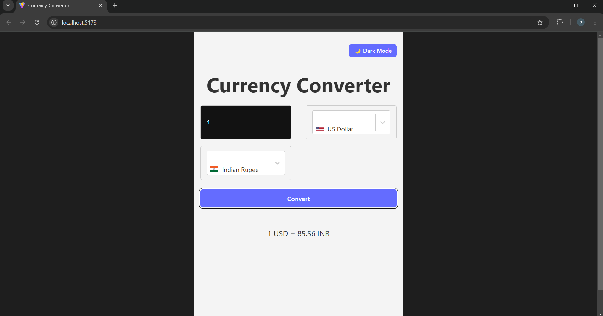
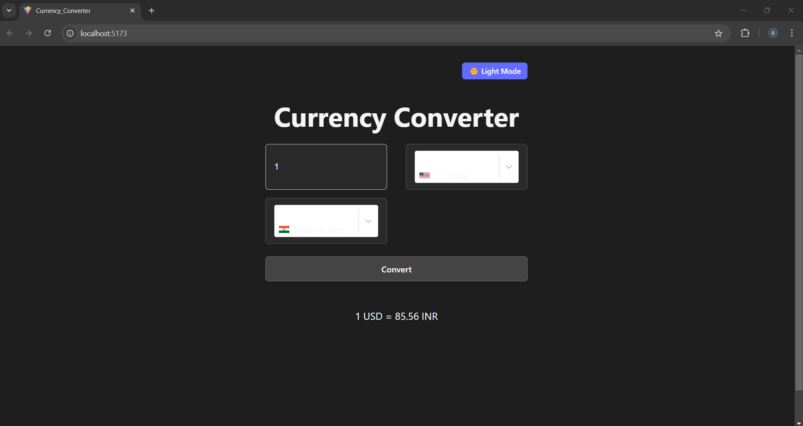

# Currency Converter App

A responsive and user-friendly Currency Converter built using **React** and **Vite**. This application allows users to convert between multiple currencies using live exchange rates. It features image-based flags, dark mode toggle, searchable dropdowns, a loading spinner, and mobile responsiveness.

---

## 🌟 Features

- 🔄 Live currency conversion using ExchangeRate API  
- 🌍 Country flags using flag images  
- 🌙 Light/Dark mode toggle  
- 🔎 Searchable dropdowns with `react-select`  
- ⏳ Loader animation while fetching data  
- 📱 Fully responsive on all devices  

---

## 📸 Preview

### Preview 1  


### Preview 2  


### Preview 3  


> 📁 Make sure you place these images inside the `Preview/` folder with the exact filenames above.

---

## ⚙️ Tech Stack

- React  
- Vite  
- React Select  
- CSS (Dark Mode, Responsive Design)  
- ExchangeRate API  

---

## 🚀 Setup Instructions

1. **Clone the repository**
   ```
   git clone https://github.com/Shweta4499/Currency-Converter.git
2.Navigate to the project directory
```
  cd Currency-Converter
```
3.Install dependencies
```
npm install
```
4 Start the development server
```
npm run dev
```

5 Open your browser and visit
```
http://localhost:5173
```
📡 API Reference
ExchangeRate API

👩‍💻 Author
Shweta Gurav
